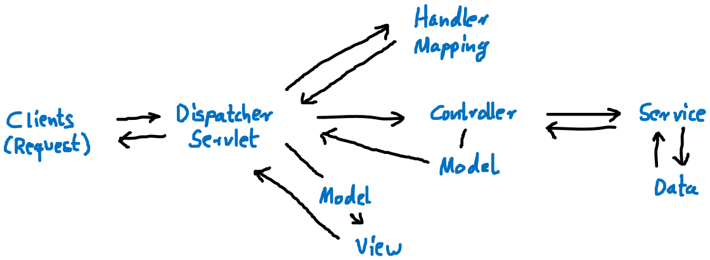

# SpringPlayground

These are my notes on the great course [Spring Core - Learn Spring Framework 4 and Spring Boot on Udemy](https://www.udemy.com/spring-core). This repository does not include everything mentioned in the course, so go ahead and have a look at the other great courses from the [springframeworkguru John Thompson](https://springframework.guru)!

Also, the most part of this code is also published in [Johns repository for the workshop](https://github.com/springframeworkguru/spring-core-spring-mvc).

## History
- 1998 EJB Specification, aimed for scalability, security, high availability, by Sun. Multiple problems in usage, for example tightly coupled to application server
- 2004 first release Spring as OpenSource (Spring Source, today Pivotal). Better testability because parts of implementation easily interchangeable by mocks or other implementations
- today: Spring greatest market share. However, EJB also developed further. However, a lot of debate on how EJB will be developed in the future.

## Spring Core
- = central part of Spring framework
- Spring beans = simple Java Objects (POJO)
- by design, Spring Beans are meant to be simple, not overly complex objects (Single Responsibility Principle)
- Dependency Injection (DI)
	- = dependent objects are injected into class at hand
	- first largely absent in original EJB specification
- Inversion of Control (IoC)
	- Spring Framework is in control and manages software components and injection of components into dependent objects
- DI + IoC allow for loosely coupled classes: when testing a web controller, inject mock database or mock service instead of the real classes
- Spring Context = "what all brings together". Knows beans and configuration and injects objects accordingly
- a lot of projects around Spring Core, for example Data, MVC, Security, Boot

## Hello World
- in package 01_helloWorld major concepts of Spring shown in practice

## Dependency Injection & Inversion of Control
- package 02_dependencyInjection
- Spring manages dependencies
- dependencies can be composed at runtime instead of compile time. Often-seen example in legacy code: data-sources hardwired to classes using them. 

### types of DI
1. constructor-based
1. setter-based
- [constructor-based DI is preferred](https://stevenschwenke.de/useDependencyInjectionViaConstructor)
- interface-based DI: best practice to code dependencies to an interface, for more flexibility in testing

## Spring Profiling
- package 03_profiling
- different profiles cause different beans to be injected

### Default profiles
- if profile in service-impl-classes is "default", this implementation is chosen if no active profile is set in properties-file (and gets overridden if there is a profile in the properties file)
- an implementation can be default and additionally named:

    @Profile({"default", "english"})

## Spring Java Configuration
- originally, Spring used XML-based configuration
- movement towards Java configuration
- today: everything possible with XML also possible in Java config
- Java config debuggable, huge plus
- package 04_javaConfiguration
- Spring Boot sets up a component scan for the package that it's in
- in code for this section: _JavaConfigurationApplication_ moved to package _springboot_ so that automatic component scan will not detect other classes
- adding manual scan to _JavaConfigurationApplication_ solves this:

    @ComponentScan("demo")

- Moving declaration of _HelloWorldServiceEnglishImpl_ and _HelloWorldServiceSpanishImpl_ from these classes to new class _Config_    

## Other concepts mentioned in the course
- @Primary to mark the primary interface in case of multiple candidates are found
- @Qualifier in combination with @Bean(name="xy") to autowire by name instead of by type

## Spring MVC
- Spring module dealing with web requests, REST services and SOAP-Services
- MVC = design pattern to separate concerns. So don't let the view make database requests or your controllers talk to other web services!

- developer only has to implement controllers, views and services (others provided by Spring)

### Hello World
- package _05_SpringMVCHelloWorld_ 
    1. created via IntelliJ IDEA Spring initializr with _web_ and _Thymeleaf_
    2. _IndexController_ and _index.html_ manually added as first, very simple parts 

### WebJars
- package _06_SpringMVCWebJars_
- "[webjars](https://www.webjars.org) are client-side web libraries packaged into JAR files"
- no need to manually put single files into resource folders
- instead insert into project using Maven
- in this project: BootstrapCSS and JQuery
- both not latest version to keep course compatible with what John Thompson showed 
- difference to _05_SpringMVCHelloWorld_; different styling + (viewed from browser) source code of page + backend implementation
- different use cases commited in multiple commits:
    - listing all products in a table (without actual database, that's simulated via a HashMap)
    - generating a link for each product to see it in detail

## Tooling
- Spring Initializr in IntelliJ IDEA: File -> new -> Project -> Spring Initializr -> easy setup for new applications 

# TODO
[ ] Read forums on Udemy
[ ] Have a look at Martins Github-Repos

# sources
- [Spring Core - Learn Spring Framework 4 and Spring Boot (Udemy)](https://www.udemy.com/spring-core)